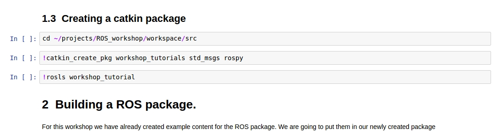

# ROS workshop

This repository contains teaching materials for an introductory workshop about the [Robotic Operating System (ROS)](http://www.ros.org/), which is organized as a dissemination activity for the TETRA project '[Ad Usum Navigantium](http://adusumnavigantium.groept.be/)' at the Catholic university of Leuven, Belgium.

ROS is an open-source, meta-operating system used in robotics research and industry. It combines the efforts of developers around the world, so that others have to spend less time ’reinventing the wheel’. It provides functionality like hardware abstraction,localization, navigation, visualization and much more in a communication infrastructure that is easy to scale. The learning curve for ROS can be quite steep, which 

In this one-day workshop, we address some of the main topics needed for getting started with the robotics operating system. Following this workshop, you should have a solid grasp of the core concepts of ROS. You'll be able to make your own packages, and learn how to use software developed by others. The workshop is divided into 4 main chapters:

1. Introduction: a general introduction to what ROS is, what is can('t) be used for and how it compares to other similar tools.
2. Hello world example: following the general introduction, we will dive right into how to develop software ROS by means of a  minimal working (or 'Hello world') example.
3. Simulation: you don't always need a robot to develop the initial version of your programs. By using the [Gazebo physics simulator](http://gazebosim.org/), it becomes possible to simulate one or more robots in a simulated environment. This chapter helps you get started with Gazebo and Unified Robot Description Format (or URDF ) files.
4. [Hands on with the Turtlebot 3](http://nbviewer.jupyter.org/github/robinamsters/ROS_workshop/blob/master/tutorials/3_Hands_on_with_TB3.ipynb): off course working with ROS is the most fun when you can run your programs on an actual robot. In this final part of the workshop you will gain some practical experience with the [Turtlebot 3](https://www.turtlebot.com/). Which is a low-cost, open source robot platform.

## Recommended reading

Most of the information you'll need will be in the tutorials themselves. However, we recommend having a basic knowledge of Linux and terminal commands beforehand. You can learn more about Linux on [our wiki](https://github.com/RobinAmsters/ROS_workshop/wiki/Linux-basics). Basic knowledge of the Python programming language is optional, but can be useful if you want to fully understand the source code of the ROS nodes.

## How to view the tutorials

### Viewing online

The tutorials can be viewed statically online. This means that you won't be able change or execute any of the code. The explanations are still present, however, so you could use this format to quickly consult the materials later.

#### github

The tutorials can be viewed directly on github itself by selecting the relevant document in the [tutorials folder](https://github.com/RobinAmsters/ROS_workshop/tree/master/tutorials). Certain features like the table of contents or math rendering don't work properly, but it is the quickest way to access the tutorials.

#### nbviewer

nbviewer provides an Jupyter Notebook server that renders notebooks stored at github (or elsewhere). The rendering is done in real time when you load the book. Functionality is slightly better than github, but it is still a only a static (i.e. non-interative) render of the notebooks. You can access the tutorials via [this link](https://nbviewer.jupyter.org/github/RobinAmsters/ROS_workshop/tree/master/tutorials/).

### Viewing locally with jupyter 

The tutorials are meant to be interactive, the best way to achieve this is to download the files, install jupyter and start a notebook server (the first two steps are already taken care of if you are following the workshop in person). This will allow you to run the code cells, change values and then run them again with these changed values. Initial setup is admittedly a bit cumbersome, this is a trade-off for the increased interactivity.

1. To download the files:
   1. Either select the clone or download button to download the files in a .zip. 
   2. Or clone the repository with  `git clone https://github.com/RobinAmsters/ROS_workshop`

2. To install jupyter, take a look at the [software installation page](https://github.com/RobinAmsters/ROS_workshop/wiki/Software-installation) on the wiki.

3. To start a notebook server, simply execute `jupyter notebook` in a terminal. A new tab will now open in your browser. Navigate to the tutorial you want to read (located in the 'tutorials' subdirectory) and start learning ROS! The tutorials are contain both code and text. You can recognize code blocks by their grey outline:

   

   To execute the code contained in these blocks you can either:

      	1. Click on the cell such that a cursor appears inside it, and subsequently press Ctrl+Enter
        2. Use the 'run cell' button in the notebook toolbar at the top of the window: 

   To stop the execution of a certain cell, use the 'interrupt kernel' button next to the 'run cell' button in the toolbar. Once caveat is that each jupyter notebook can only run 1 terminal command at a time. When executing and debugging ROS programs, you will often find yourself requiring more than one terminal. You can always open additional terminals, either in a new window with Ctrl+Alt+T, or in the same window as a new tab with Ctrl+Shift+T. Alternatively, if you want to keep everything in the same browser window, you can also open a terminal from jupyter by selecting new -> terminal from the notebook server tab (not the tab with the tutorial, rather the first one that opens in the browser when executing `jupyter notebook`) 

   ​

## Further reading

Want to learn even more ? Below you will find some additional rescources:

- A great book to get you started is [A gentle introduction to ROS by Jason M. O'Kane](https://www.cse.sc.edu/~jokane/agitr/). This book is freely available and a good choice if you are completely new to ROS. It uses the C++ programming language, but don't worry if you don't know the language when starting the book. 
- The [ros wiki](http://wiki.ros.org/) contains a plethora of information on various topics. The [tf](http://wiki.ros.org/tf/Tutorials) and [URDF](http://wiki.ros.org/urdf/Tutorials) tutorials could be particularly interesting. 
- To learn more about Gazebo, consider taking a look at the considerable list of [Gazebo tutorials.](http://gazebosim.org/tutorials)